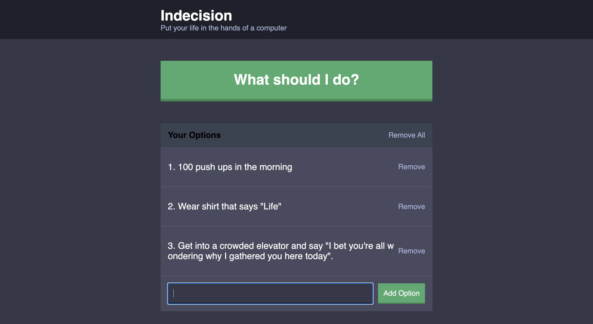

# TO DO APP with React, custom Components and Webpack


<p align="center"></p>


## Table of contents
* [General info](#general-info)
* [Technologies](#technologies)
* [Inspiration](#inspiration)

## Technologies
Project is created with:
* React: 16.0.0

## Setup
To run this project, install it locally using npm:

```
$ cd ../<project-name>
$ npm install
$ npm run dev-server
```

Open browser and navigate to the default port used by ReactJS development server: http://localhost:8080

## Inspiration
* React udemy course andrew
